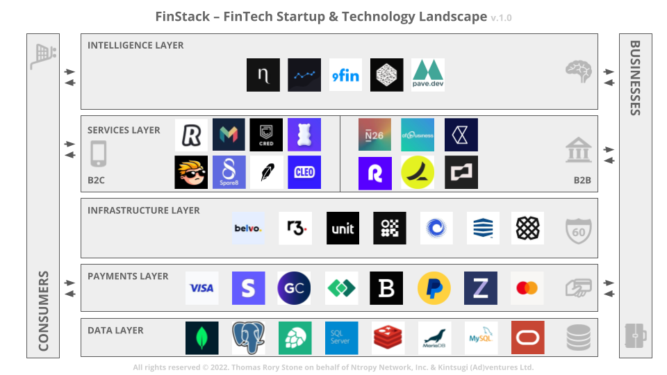

# Resources

## Go

1. Go with Versions by Russ Cox [video_link](https://www.youtube.com/watch?v=F8nrpe0XWRg)

## Cloud Architecture

1. No, we don’t use Kubernetes [article_link](https://ably.com/blog/no-we-dont-use-kubernetes)

## Non Tech

1. Open Decision-Making [article_link](https://web.stanford.edu/~ouster/cgi-bin/decisions.php)

## FinTech

1. FinStack [artical_link](https://kintsugiad.medium.com/finstack-fintech-startup-landscape-q4-2022-d23119ed1cf0)

